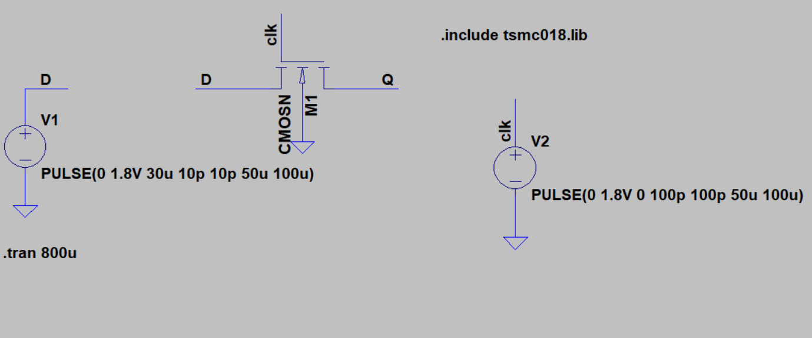

# Latches and Flipflop
In this project we will be analyzing the working of different types of latches and then making a flipflop out of the preferable one.We will be using LTSpice as a simulator and tsmc180 library for this purpose.

# What is a latch?
A latch is circuit that can either hold a data or become transparent to input depending on the state of clock.In a typical level sensitive latch,it passes the input to output when the clock is HIGH,any change in input will be reflected at output when the clock is HIGH.When the clock gets LOW,the latch holds the latest data and will be insensitive to changes in input.

# Design 1
We try to implement a very basic form of a latch in this design.We just use the concept of pass transisor to achieve the transparency.The corresponding design can be seen below.

