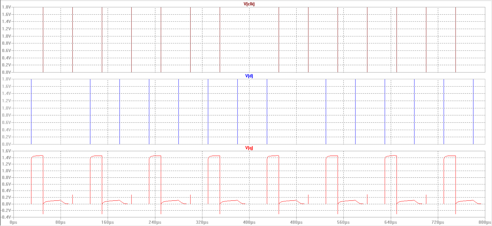
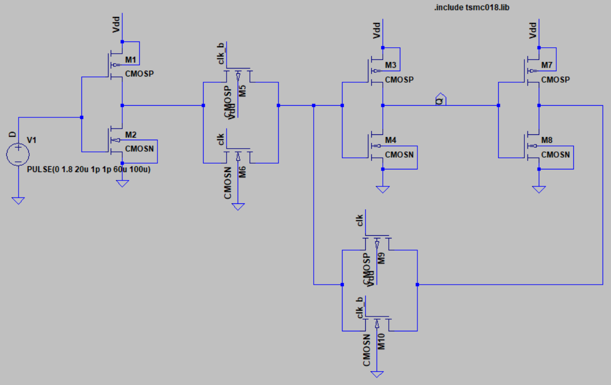
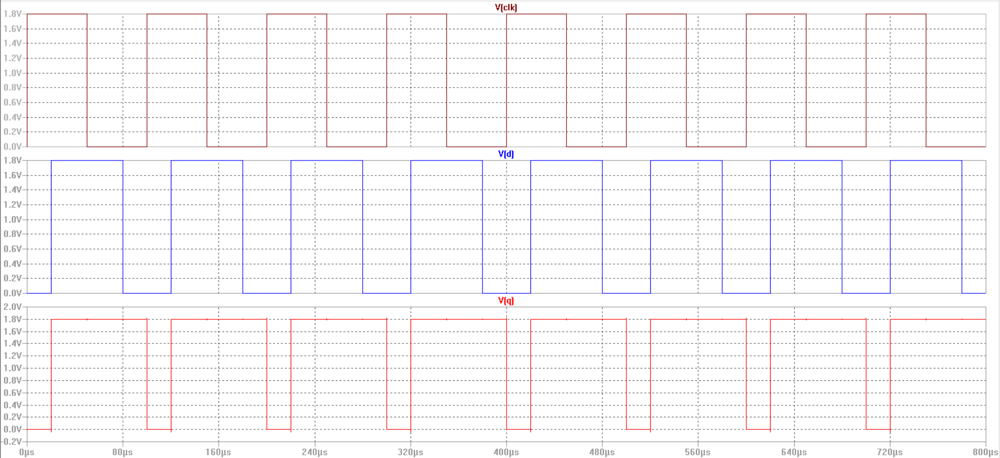

# Latches and Flipflop
In this project we will be analyzing the working of different types of latches and then making a flipflop out of the preferable one.We will be using LTSpice as a simulator and tsmc180 library for this purpose.

# What is a latch?
A latch is circuit that can either hold a data or become transparent to input depending on the state of clock.In a typical level sensitive latch,it passes the input to output when the clock is HIGH,any change in input will be reflected at output when the clock is HIGH.When the clock gets LOW,the latch holds the latest data and will be insensitive to changes in input.

# Design 1
We try to implement a very basic form of a latch in this design.We just use the concept of pass transisor to achieve the transparency.The corresponding design can be seen below.

The basic idea is,when clk is HIGH,output Q will be transparent to D and when clk is LOW,it should hold the latest value.But as we no NMOS pass weak-1,so output will be less than Vdd by one threshold voltage.So the output is not completely transparent to D.Moreover,when the clock goes LOW,the output node is floating,it discharges quickly and is unable to hold the value.We witness this behaviour according to the output obtained below.

Thus the above circuits have lots of demerits as:
1. It is not completely transparent to input.
2. It cannot hold the data when latch is inacive.

Considering such demerits,we look for a new design that can perform according to expectation.

# Design 2
In this design we try to address the issues of the previous design.
- In the previous design,one of the issues was that latch is not completely transparent.It was passing weak-1 or weak-0 depending on the type of transistor we use.We resolve this issue by using a transmission gate that uses both NMOS and PMOS in parallel and so would be getting both strong-0 ans strong-1.
- Another issue was,that the circuit was not able to hold the data when the latch is inactive.To solve this issue,we use two inverters back to back as they will be forming a feeback kind of thing and we would be able to hold the output.

The design so proposed,is realised as shown below.

In this design,instead of providing input,D direcly to diffusion input of the transmission gate,we use an inverter to buffer the input.If we apply input directly todiffusion input of transmission gate,there may be noise,so we use an inverter.When the clock is HIGH,the feedback path is broken by the OFF transmission gate and the latch is transparent.When clock is LOW,the input is disconnected by the OFF transmission gate and the feedback path is complete that holds the data.This design will work as desired.The latch is transparent to input when clock is HIGH and opaque when clock is LOW.The output so obtained is shown below.

So we see that we are able to achieve the required functionality of latch.This design requires 10 transistors.If we further wish o reduce the number of transistors,we may try out the design described below.

# Design 3
If we wish to reduce the number of transistors,we may remove the transmission gate on the feedback path and try observing the behaviour.The modified circuit is shown below.
